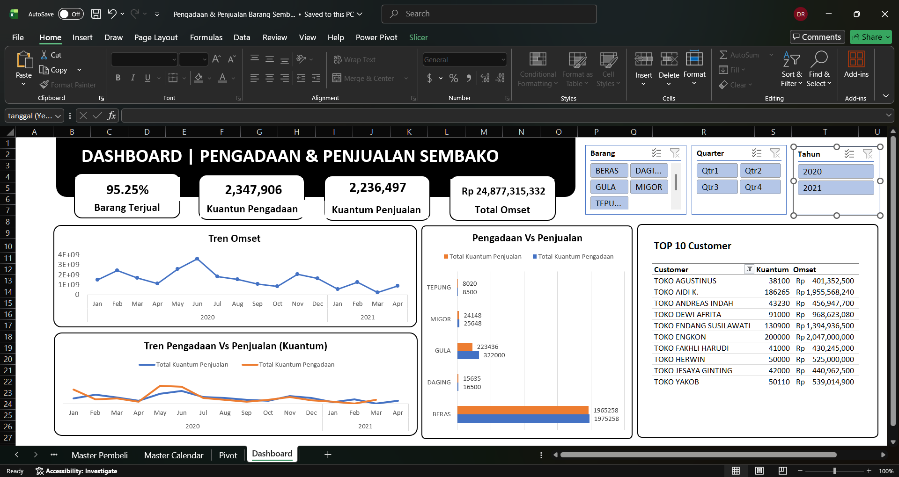

# 🌾Dashboard Penjualan dan Pengadaan Barang Sembako🥚  
  

### Overview Project
Project ini bertujuan membuat alat monitoring untuk pengadaan dan penjualan barang di toko sembako. Menggunakan Ms. Excel karena kebanyakan toko sembako masih menggunakan Ms. Excel sebagai alat pencatatan data. Dashboard ini dirancang untuk mengetahui omset, persentase barang terjual, tren pengadaan dan penjualan untuk melihat gap antara keduanya, dll.

### Data, Tools, dan Dashboard
Data berupa 2 file CSV (pemasukan dan penjualan barang) yang diambil dari platform Kaggle [(https://www.kaggle.com/datasets/bejopamungkas/transaksi-pembelian-penjualan-sembako?)](https://www.kaggle.com/datasets/bejopamungkas/transaksi-pembelian-penjualan-sembako?). Di dalam file pemasukan barang terdapat data: tanggal, nama barang, dan kuantum. Sedangkan pada file penjualan terdapat data: tanggal, nama pembeli, nama barang, kuantum, dan nominal.

Kedua file tersebut digabungkan menjadi 1 file Ms. Excel. Data kemudian diproses untuk pemodelan data, model relasi antar data adalah sebagai berikut:  

  

Link Dashboard: [./Pengadaan%20&%20Penjualan%20Barang%20Sembako.xlsx](./Pengadaan%20&%20Penjualan%20Barang%20Sembako.xlsx)
 

  

### Rangkuman Insight
Bisnis sembako ini **secara keseluruhan sehat dari sisi efisiensi stok** (95,25% terjual) dan sangat bergantung pada BERAS sebagai produk utama (83% omset), **namun mengalami penurunan tajam pada omset dan kuantum penjualan** (masing-masing -62,9% dan -68,4%) **Q1 2021 dibanding Q1 2020**, terutama didorong oleh hilangnya pesanan besar BERAS, sementara produk lain seperti MIGOR dan TEPUNG justru tumbuh signifikan.

**Terdapat ancaman resiko konsentrasi dan inefisiensi** pengadaan yang perlu segera diatasi. Jika diamati lebih lanjut, **basis omset yang terlalu bertumpu pada segelintir pelanggan besar** (Top 10 dari 171 pelanggan menyumbang 36,8% omset) dan **tumpukan stok GULA yang tidak terjual** (98.564 unit, sell-through hanya 69%).

### Saran Action

| No | Masalah | Action | Prioritas |
|----|---------|--------|-----------|
| 1 | Penjualan BERAS anjlok -62,9% (omset) dan -68,4% (kuantum) di Q1 2021 vs Q1 2020, padahal ini produk andalan (83% omset) | Investigasi penyebabnya dengan menghubungi ulang pelanggan besar seperti TOKO ENGKON dan TOKO AIDI K. Cari tahu apakah mereka pindah supplier atau permintaan pasar memang turun | Tinggi |
| 2 | Stok GULA menumpuk 98.564 unit tak terjual. Sell-through cuma 69%, jauh di bawah produk lain yang 94-99% (slow moving) | Kurangi volume pengadaan GULA untuk sementara, atau buat promo/bundling GULA dengan BERAS untuk mempercepat stok keluar | Tinggi |
| 3 | MIGOR (+179,8%) dan TEPUNG (+47,1%) justru tumbuh pesat di tengah penurunan BERAS, tapi kontribusinya ke omset masih kecil (gabungan hanya ~1,5%) | Alokasikan tambahan effort pemasaran dan pengadaan ke dua produk ini selagi tren sedang positif | Sedang |
| 4 | Omset terlalu bergantung pada segelintir pelanggan besar (Top 10 dari 171 pelanggan menyumbang 36,8% omset) | Bangun program untuk menaikkan kelas pelanggan menengah (di luar Top 10), supaya omset tidak rentan goyang kalau satu-dua whale customer berhenti order | Sedang |
| 5 | Tren penurunan seperti kasus BERAS berisiko terulang di produk lain tanpa disadari sejak dini | Jadikan dashboard ini alat monitoring bulanan berkelanjutan, bukan laporan sekali jalan, agar tim bisa mendeteksi pola serupa lebih cepat | Opsional namun direkomendasikan |
