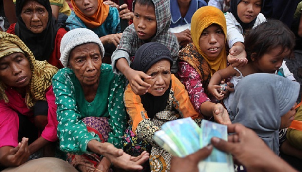
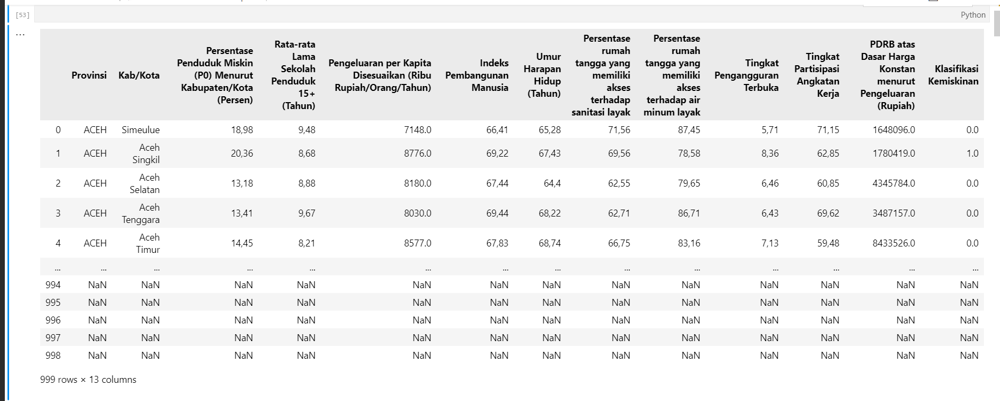

# Klasifikasi Kemiskinan di Indonesia
  
Seperti yang kita tahu, Indonesia adalah negara kepulauan yang memiliki 284.889.720 jiwa penduduk (Februari 2025) dengan keberagaman kondisi sosial dan ekonomi di setiap wilayah. Saya memulai project ini dengan tujuan membuat analisis dan visualisasi pengaruh faktor ekonomi, sosial dan distribusi kemiskinan terhadap hasil akhir suatu daerah di Indonesia dikatakan miskin tidaknya.

#### Langkah-langkah project :
- Data collecting
- Data pre-processing
- Analisis & visualisasi
#### Lingkungan & alat kerja :
- Kaggle
- Visual Studio Code
- Python
- Pandas
- Chat GPT
- Microsoft Power BI

___
## Data Collecting
Pada proses data collecting (pengumpulan data) ini, saya menggunakan platform [Kaggle](https://www.kaggle.com/). Kaggle adalah website yang salah satu kegunaannya adalah gudang dataset. Berikut ini adalah link dataset (raw data) yang saya gunakan pada project ini: [https://www.kaggle.com/datasets/ermila/klasifikasi-tingkat-kemiskinan-di-indonesia](https://www.kaggle.com/datasets/ermila/klasifikasi-tingkat-kemiskinan-di-indonesia).

#### Data Attribute : 
- Provinsi = Provinsi di Indonesia
- Kabupaten/Kota = Kabupaten/Kota di Indonesia
- Persentase Penduduk Miskin (P0) Menurut Kabupaten/Kota (Persen) = Persentase penduduk miskin di daerah tertentu
- Rata-rata Lama Sekolah Penduduk 15+ (Tahun) = Rata rata lama sekolah penduduk di daerah tersebut (hanya orang berumur 15+ yang dihitung)
- Pengeluaran per Kapita Disesuaikan (Ribu Rupiah/Orang/Tahun) = Rata-rata pengeluaran per individu dalam setahun (setelah disesuaikan dengan faktor yg tertera)
- Indeks Pembangunan Manusia = ukuran komprehensif yang menggambarkan kualitas hidup masyarakat di daerah tersebut (dihitung berdasarkan 3 dimensi utama: Umur harapan hidup, pendidikan, pengeluaran per-kapita)
- Umur Harapan Hidup (Tahun) = Rata-rata perkiraan lama hidup penduduk di daerah tersebut
- Persentase rumah tangga yang memiliki akses terhadap sanitasi layak = Persentase penduduk di daerah tersebut yang memiliki akses terhadap sanitasi yang layak
- Persentase rumah tangga yang memiliki akses terhadap air minum layak = Persentase penduduk di daerah tersebut yang memiliki akses terhadap air minum yang layak
- Tingkat Partisipasi Angkatan Kerja =  Persentase penduduk usia kerja di daerah tersebut (baik yang sedang bekerja maupun yang sedang mencari pekerjaan)
- Tingkat Pengangguran Terbuka = Persentase pengangguran yang sedang mencari pekerjaan
- PDRB atas Dasar Harga Konstan menurut Pengeluaran (Rupiah) = Nilai total barang dan jasa yang dihasilkan oleh suatu daerah dalam satu tahun, dihitung berdasarkan harga konstan (tidak terkena inflasi).
- Klasifikasi Kemiskinan = Suatu daerah dikategorikan miskin tidaknya (0 (False) berarti tidak miskin, (1) True berarti miskin)
___
## Data Pre-processing

Pada langkah data pre-processing ini saya melakukan berbagai kegiatan, antara lain: data cleaning (mengatasi data yang rusak/hilang), data standardizing (memperbaiki tipe data yang salah), features selection (mempertimbangkan kolom mana yang dipakai atau tidak, mempertimbangkan apakah diperlukan kolom tambahan atau tidak). Saya menggunakan file Jupiter Notebook yang menggunakan bahasa Python dengan tambahan library Pandas.

#### Hal-hal yang saya lakukan :
- Import data mentah (biasa disebut extract dalam proses ETL) menggunakan pandas.read_csv()
- Mengidentifikasi null values di setiap kolom (485 rows null values ditemukan)
-  Membuang 485 rows yang semua kolomnya berisi null values (total raw data ada 999 rows, sisa 514 rows data tanpa null values)
- Mengganti tipe data pada kolom 'Klasifikasi Kemiskinan' dari float ke boolean
- Melakukan pembulatan dan pengubahan tipe data menjadi integer pada :
    - kolom 'Umur Harapan Hidup (Tahun)'
    - kolom 'Rata-rata Lama Sekolah Penduduk 15+ (Tahun)'
    - Pengeluaran per Kapita Disesuaikan (Ribu Rupiah/Orang/Tahun)
- Mengubah tipe data dari object (string) menjadi float pada kolom :
    - Persentase Penduduk Miskin (P0) Menurut Kabupaten/Kota (Persen)
   - Persentase rumah tangga yang memiliki akses terhadap sanitasi layak
   - Persentase rumah tangga yang memiliki akses terhadap air minum layak
   - Indeks Pembangunan Manusia
   - Tingkat Pengangguran Terbuka
   - Tingkat Partisipasi Angkatan Kerja
- Mengimport data yang sudah di pre-processing (biasa disebut load dalam proses ETL) sebagai file csv (data clean.csv)
___ 
#### Beberapa dokumentasi selama pre-processing (sisanya bisa dilihat pada file 'data pre-processing.ipynb')
- Null values sebelum di cleaning (kiri/atas) dan sesudah di cleaning (kanan-/bawah)
.png) .png)

- Membuang 458 rows yang isinya hanya null values
.png) .png)

- Mengganti tipe data yang salah
.png) .png)
___
## Analisis & Visualisasi
