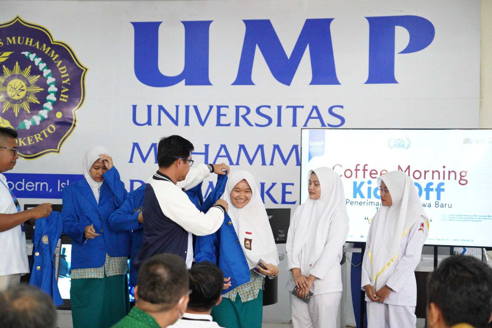

# Visualisasi Tren Penerimaan Mahasiswa Baru UMP 2014-2024  
  

#### Latar belakang
Proyek ini dibangun karena adanya kesulitan saat melakukan analisis data pendaftar mahasiswa baru di UMP yang disebabkan tidak adanya visualisasi sehingga proses evaluasi dan analisis strategi marketing masih dilakukan secara terbatas.

#### Tujuan proyek
Proyek ini bertujuan untuk merancang dan membangun dashboard visualisasi data pendaftar mahasiswa baru (2014 - 2024) di UMP sebagai alat bantu evaluasi strategi marketing.

#### Tahapan pelaksanaan proyek :
- Pengumpulan data
- Data preprocessing
- Visualiasi

#### Lingkungan & alat kerja :
- Visual Studio Code
- Tableau Public
- Python
- Pandas
- Chat GPT & Perplexity AI
- Github

___
## Pengumpulan Data
Karena alasan keamanan, proses pengumpulan data di database UMP tidak dilakukan langsung oleh penulis, melainkan oleh mitra proyek (BPA UMP). Berikut ini adalah dokumentasi dari tahap pengumpulan data:  

  
  
  

#### Tentang data :
- Data yang dikumpulkan meliputi data mahasiswa yang berstatus mahasiswa baru dalam kurun tahun 2014-2024.
- Dataset mentah yang diterima berupa 10 file berekstensi Ms. Excel
- Pada data mentah, terdapat 74 kolom informasi yang nantinya akan diseleksi pada tahap Preprocessing

#### Atribut dataset (Setelah preprocessing) :
- NOPEN = Nomor pendaftaran mahasiswa baru
- JALUR = Jalur masuk mahasiswa baru
- TAHUN = Tahun masuk mahasiswa baru
- PILIHAN PRODI 1 = Pilihan program studi pertama mahasiswa baru pada saat mendaftar
- FAKULTAS PRODI 1 = Fakultas dari program studi pilihan pertama
- PILIHAN PRODI 2 = Pilihan program studi kedua mahasiswa baru pada saat mendaftar
- FAKULTAS PRODI 2 = Fakultas dari program studi pilihan kedua
- DITERIMA PRODI = Program studi yang menerima mahasiswa baru tersebut
- FAKULTAS PRODI DITERIMA = Fakultas dari program studi yang menerima mahasiswa baru tersebut
- USIA = Usia mahasiswa baru pada saat mendaftar
- ASAL SLTA = Asal sekolah mahasiswa baru sebelum mendaftar
- JURUSAN = Jurusan asal sekolah mahasiswa baru sebelum mendaftar
- ALAMAT ASAL = Alamat asal mahasiswa baru
- ALAMAT DOMISILI = Alamat domisili mahasiswa baru
- PEND. AYAH = Jenjang pendidikan ayah dari mahasiswa baru
- PEND. IBU = Jenjang pendidikan ibu dari mahasiswa baru
- PEKERJAAN IBU = Pekerjaan ibu dari mahasiswa baru
- ALAMAT ORANG TUA = Alamat orang tua mahasiswa baru
- Kabupaten/Kota = Kabupaten/Kota asal domisili mahasiswa baru
- PROVINSI = Provinsi asal domisili mahasiswa baru

___
## Data Preprocessing
Proyek ini memiliki 4 tahap preprocessing , yaitu: penggabungan dataset, pemilihan kolom, validasi data, dan problem solving. Detail dari tahapan preprocessing adalah sebagai berikut :

### Penggabungan dataset
Dataset mentah yang diterima dari mitra proyek (BPA UMP) merupakan 10 berkas Microsoft Excell. Untuk alasan efisiensi pada tahap Preprocessing, penggabungan dataset ini diperlukan. Berikut ini adalah dokumentasi dari tahap ini:  

  

### Pemilihan kolom
Berfungsi untuk mengurangi jumlah kolom informasi dari dataset mentah dan menyisakan kolom informasi yang diperkirakan akan berguna pada tahap visualisasi. 
- Sample kolom sebelum dipilih (74 kolom):  
  
- Kolom setelah pemilihan:  

### Validasi data & Problem Solving
Validasi bertujuan untuk menilai tingkat kelengkapan dan akurasi data yang tersaring. Pada proyek ini, terdapat 4 aspek utama yang akan divalidasi: Struktur data, duplikasi data, missing/null values, dan distribusi data. Sedangkan problem solving bertujuan untuk mengatasi daftar masalah yang ditemukan pada proses validasi data.

#### Struktur Dataset
Bertujuan untuk menentukan kesesuaian tipe data tiap kolom informasi.
- Strukur dataset sebelum:  
 

- Struktur dataset sesudah:  
  

#### Duplikasi Data
Bertujuan untuk menghapus semua data yang 100% terduplikat
- Jumlah data duplikat ditemukan:  
  
- Sample data duplikat:  
 
- data duplikat setelah dihapus:  
 

#### Missing/null Values
Berfungsi untuk mendeteksi dan menangani data yang hilang/rusak. Metode yang digunakan adalah statistical imputation (untuk numeric), dan label imputation (untuk kategorikal).
- missing/null values sebelum:  

- missing/null values sesudah:  

#### Distribusi Data
Berfungsi untuk melihat sekaligus mengatasi nilai anomali (nilai yang seharusnya tidak ada) dalam persebaran data. Metode yang digunakan untuk mengatasi anomali adalah statistical imputation (numeric) dan label imputation (kategorikal) 
- sample distribusi data sebelum:  

- sample distribusi data sesudah:  

___
## Visualisasi
Visualisasi memudahkan pemahaman data yang kompleks dengan mengubahnya menjadi bentuk visual yang mudah dipahami seperti grafik, bagan, dan peta. Proyek ini memiliki 2 tahap pada visualisasi yaitu brainstorming dan realiasi:

#### Brainstorming visualisasi
Brainstorming bertujuan agar tahap visualisasi bisa dilaksanakan secara terstruktur dan tidak asal "klik" dengan mengharapkan insight yang berguna. Berikut ini detailnya:

|  | Tujuan | Bagian 1 | Bagian 2 | Bagian 3 | Bagian 4 |Bagian 5 |
|:------:|---------|---------|---------|---------|---------|---------|
| Dashboard Overview  | Dashboard ini dirancang untuk memudahkan pemangku kepentingan dalam memahami tren penerimaan mahasiswa baru secara overall | Total mahasiswa, total jalur masuk, persebaran jenis asal SLTA |Bagaimana grafik jumlah mahasiswa baru dalam 10 tahun terakhir? |Jalur apa yang digunakan para mahasiswa tersebut? |Bagaimana jumlah distribusi mahasiswa baru per-fakultas? |Program studi apa yang paling diminati mahasiswa baru? |
| Dashboard Demografi  | Dashboard ini lebih ditekankan untuk bisa melihat pola demografi mahasiswa baru, terutama distribusi asal daerah | Umur rata-rata, jumlah pekerjaan orang tua, jumlah SLTA | Daerah mana saja yang menyumbang mahasiswa paling banyak? |Apa saja pekerjaan orang tua para mahasiswa baru? |Bagaimana distribusi pendidikan terakhir orang tua mahasiswa baru? |SLTA mana saja yang menjadi top 10 penyumbang mahasiswa baru? |

#### Dashboard Overview

#### Dashboard Demografi

---

##### Link Dashboard:[https://public.tableau.com/app/profile/dhika.ramadhan.saputra/viz/worksheettableau_17468451606110/DashboardOverview](https://public.tableau.com/app/profile/dhika.ramadhan.saputra/viz/worksheettableau_17468451606110/DashboardOverview)